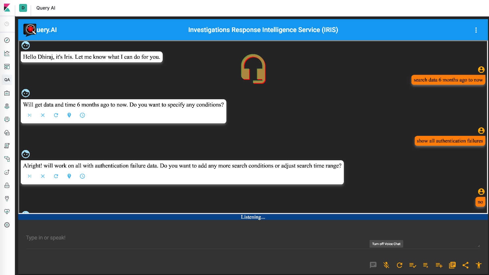

# AI-Analyst

AI-Analyst is a plugin to embed the Query.AI AI Analyst (https://ai.query.ai) in Kibana UI.



### Installation
- Prerequisites
  - Download and install Elasticsearch and Kibana
  - AI-Analyst is supported and tested with Kibana 7.x and 6.x
  - Install AI-Analyst plugin (requires restart of Kibana after install)
  - Kibana 7.3.0 : `./bin/kibana-plugin install https://github.com/query-ai/queryai-kibana-plugin/releases/download/7.3/Query.AI-kibana-plugin.7.3.zip`
  - Other versions : [https://github.com/query-ai/queryai-kibana-plugin/releases](https://github.com/query-ai/queryai-kibana-plugin/releases)
  - Kibana requires exact match of plugin version to the Kibana version. If you can't find AI-Analyst plugin release for a Kibana release, contact help@query.ai for help.

### Configuration
Add these lines in kibana.yml. Generally, the kibana.yml can be found at 	
`/etc/kibana`.
```
csp.rules:
  # current defaults
  - "script-src 'unsafe-eval' 'nonce-{nonce}'"
  - "worker-src blob'"
  - "child-src blob:"
  # New rule for iframes
  - "frame-src https://ai.query.ai/"
```
**Note:** The lines above are telling the Kibana's content security policy that https://ai.query.ai is a safe website and is allowed to be loaded in the Kibana UI. Without adding the above lines, the Kibana plugin won’t work.

### A note about your data:
The Query.AI AI Analyst never accesses or duplicates your data. The above rule change allows your natural language query to be sent from your Kibana instance to the Query.AI server for translation. The query is then returned and executed from your environment.
